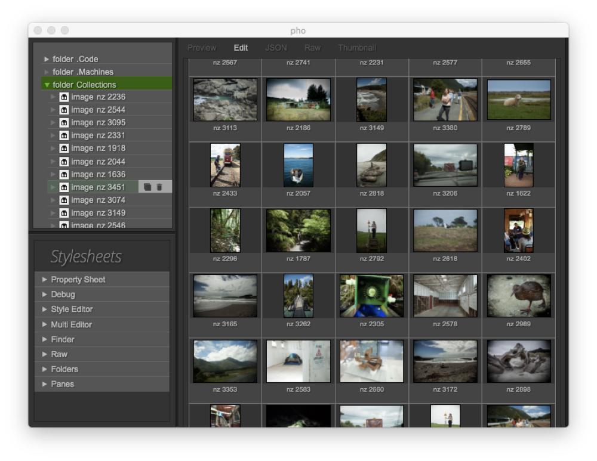

# ssb-photos

Decentralised photo sharing and collborative image editing



ssb-photos is a desktop application for Linux, OSX and Windows, based om Secure Scuttlebutt and Tre. It creates a private social network and allows user to generate invite codes for friends and familiy. Once invited, they can collaborate on organising and editing photos.

# Status

ssb-photos is under active development. See instructions below to try it out. (requires git and npm to be installed). It currently lacks end-user friendly tools to create networks and invite codes, these task currently require familiarity with the command line.

## Instllation (for development)

```
npm i -g tre-init
git clone http://github.com/regular/ssb-photos.git
cd ssb-photos
npm i
tre-init
tre-bot server
# make sure Chrome is not running when
# you run the following command line for the first time.

# In a new terminal
tre-debug index.js

# start chrome and navigate to the URL
# printed by tre-debug
```

`tre-init` here creates a new ssb network by generating a configuration for `sbot` (now callled ssb-server). This configuration can be found in `.trerc`. `tre-bot` is a small wrapper for `sbot` that makes it look for the configuration in `.trerc` and create its data directory in `.tre`. Otherwise, the data structures are standard ssb.

## Create a pub

You need to create an ssb pub to be able to share photos with others that are not in the same LAN. Follow instructions [here](https://ssbc.github.io/docs/scuttlebot/howto-setup-a-pub.html) (skip the invite step).

On your local machine in the ssb-photos project directory, run

```
tre-pub-config > config
```

Transfer the generated config file to your pub and use it instead of the stock one. That means, you copy it into `~/.ssb`, or, if you use a custom `ssb_appname`, into `~/.${ssb_appname}/config`.

Create a JSON file `.tre/remotes` on your local machine the format:

```
{
  "name of pub": "address of pub"
}
```

where `address of pub` is the output of `sbot getAddress` run on the pub.

## Create invites

Locally run `tre-invite --compact` to create an invite code for a friend. Send that code via email or messanger. Your friend needs to download [bay-of-plenty](github.com/regular/bay-of-plenty) (currently OSX only) and paste that invite code. Now you can collaborate on the photo collection.

---

This is a Prototype Fund project, in part funded by Bundesministerium fuer Bildung und Forschung. (Germany's Ministry of Science and Education)

License AGPLv3 - Copyright 2019 Jan Bölsche
